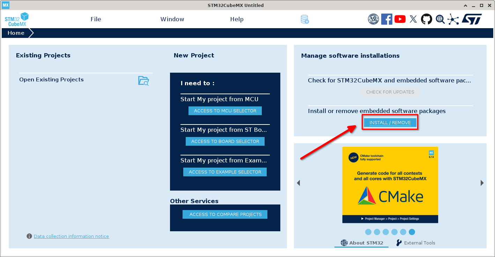
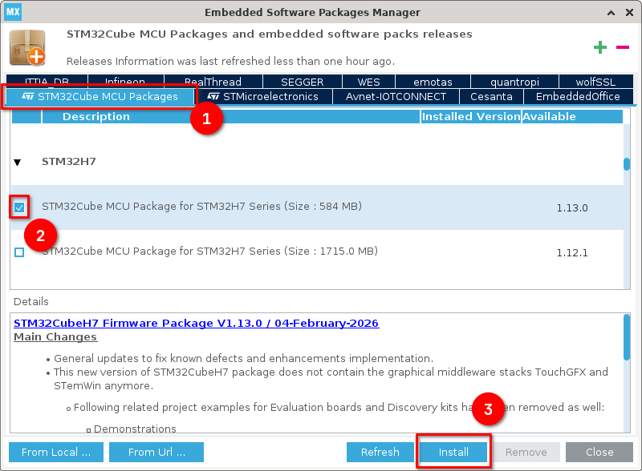

```{=typst}
#set page(
  header: align(right)[
    Version 0.2.1
  ],
  numbering: "1",
)
```

```{=typst}
#pagebreak()
```

# Background

This document describes the setup and usage of the development and build environment for the NeoECU project.

NeoECU uses an AMP (Asymmetrical Multiprocessing) architecture. Both cores of the STM32H747 are used for different tasks and run different software stacks.

Core responsibilities:

- **M7 core** — Real-time, safety-critical engine control (e.g. spark timing, ignition)
- **M4 core** — Telemetry, logging, and user interface

Because of this separation:

- M7 code must prioritize reliability and determinism  
- M4 code can tolerate higher latency and complexity  

Selected tools:

- **M7 core**
  - STM32CubeMX — MCU initialization code generation
  - FreeRTOS — Lightweight task scheduling
  - STM32 HAL — Hardware abstraction layer

- **M4 core**
  - Zephyr RTOS — Microkernel with full I/O stack

Firmware flashing is performed over JTAG using a SEGGER J-Link.

> **Note**  
> This environment is designed for Linux. Windows and macOS may work, but are not officially supported.

```{=typst}
#pagebreak()
```

# Setup

## Prerequisites

## uv (Python Tooling)

Install `uv`:

```bash
curl -LsSf https://astral.sh/uv/install.sh | sh
```

Restart your terminal, then verify installation:

```bash
which uv && uv --version
```

Expected output (example):

```text
/home/user/.local/bin/uv
uv 0.10.x
```

Install Python 3.14:

```bash
uv python install 3.14
```

Documentation: [https://docs.astral.sh/uv/getting-started/installation/](https://docs.astral.sh/uv/getting-started/installation/) 

```{=typst}
#pagebreak()
```

## Build Tools

Install CMake and Ninja:

```bash
# Arch
sudo pacman -S cmake ninja

# Debian
sudo apt update
sudo apt install cmake ninja-build

# Fedora
sudo dnf install cmake ninja-build
```

Verify installation:

```bash
which cmake && cmake --version
which ninja && ninja --version
```

## Build Dependencies

Install ARM toolchain:

```bash
# Arch
sudo pacman -S \
  arm-none-eabi-gcc \
  arm-none-eabi-newlib \
  arm-none-eabi-binutils

# Debian
sudo apt update
sudo apt install \
  gcc-arm-none-eabi \
  libnewlib-arm-none-eabi \
  binutils-arm-none-eabi

# Fedora
sudo dnf install \
  arm-none-eabi-gcc-cs \
  arm-none-eabi-newlib \
  arm-none-eabi-binutils
```

```{=typst}
#pagebreak()
```
## Zephyr

Create workspace:

```bash
mkdir ~/zephyrproject
cd ~/zephyrproject
```

Create virtual environment:

```bash
uv venv --python 3.14
source .venv/bin/activate
```

Install west:

```bash
uv pip install west
```

Initialize workspace:

```bash
west init ~/zephyrproject
cd ~/zephyrproject
west update
```
Export environment:

```bash
west zephyr-export
```

Install dependencies:

```bash
uv pip install -r zephyr/scripts/requirements.txt
```

If errors occur, install missing packages and re-run until successful.

```{=typst}
#pagebreak()
```
Install SDK:

```bash
cd ~/zephyrproject/zephyr
west sdk install
```
Add the ZEPHYR_BASE variable to your .bashrc (or equivalent):
```bash
export ZEPHYR_BASE=$HOME/zephyrproject/zephyr
```
Check your .bashrc for a line along these lines:
```bash
export ZEPHYR_SDK_INSTALL_DIR=...
```
If is doesn't exist, firstly check the SDK version installed:
```bash
cd && ls | grep "zephyr-sdk"
```
Then take this and add the following to your .bashrc (or equivalent):
```bash
export ZEPHYR_SDK_INSTALL_DIR=$HOME/zephyr-sdk-x.x.x
```
Making sure that the x.x.x matches the version you have installed.

```{=typst}
#pagebreak()
```

## STM32CubeMX

Download STM32CubeMX from  
[https://st.com/en/development-tools/stm32cubemx.html](https://st.com/en/development-tools/stm32cubemx.html)

In your downloads, unzip the package:
```bash
unzip stm32cubemx-lin-*.zip -d STM32CubeMxSetup
cd STM32CubeMxSetup
```
Run the setup binary:
```bash
./SetupSTM32CubeMX-*
```
Add the install directory to your path, add this line to your .bashrc (or equivalent):
```bash
export PATH=$PATH:$HOME/STM32CubeMX
```
It can take a few minutes for the application to start for the first time.

Then open the 'Install or remove embedded software packages' window:

{width=95%}

```{=typst}
#pagebreak()
```

In the 'STM32Cube MCU Packages' tab, find the 'STM32H7' entry and install the latest version:

{width=80%}

## JLink Tools
Download the '*J-Link Software and Documentation Package*' from  
[https://www.segger.com/products/debug-probes/j-link](https://www.segger.com/products/debug-probes/j-link)

From your downloads, install the package:
```bash
# Arch
sudo mkdir -p /opt/SEGGER/JLink
sudo tar -xvzf JLink_Linux_*_x86_64.tgz -C /opt/SEGGER/JLink --strip-components=1

# Debian
sudo apt install ./JLink_Linux_*_x86_64.deb

# Fedora
sudo dnf install ./JLink_Linux_*_x86_64.rpm
```
If JLink tooling was installed with the tar bundle, the following directory needs to be added to your path:
```bash 
export PATH=$PATH:/opt/SEGGER/JLink
```
```{=typst}
#pagebreak()
```

# Repository Setup

## Cloning

Clone the repository:

```bash
git clone gitea@git.h3cx.dev:Exergie/BuildDemoNeoECU.git
cd BuildDemoNeoECU
```

## Virtual Environment

Create a project-specific virtual environment:

```bash
uv venv --python 3.14
```

Activate it:

```bash
source .venv/bin/activate
```

This step must be repeated for each new terminal session.

## NeoECU Tooling Setup
Install the neoecu cli tooling and west for Zephyr:
```bash
uv pip install "git+https://git.h3cx.dev/h3cx/NeoECU-Tooling.git"
uv pip install west
```
Help can be found by running:
```bash
neoecu
```
Start by checking dependencies:
```bash
neoecu envcheck
```
It is normal for west to fail at this stage.

Then init the tooling system:
```bash
neoecu init
```
You can now test build the demo project:
```bash
neoecu build --debug --clean
```

```{=typst}
#pagebreak()
```
Finally you can flash it to a board, this demo targets an Arduino Giga R1.  

> **WARNING**  
> Flashing this **WILL** wipe the Arduino bootloader from the board and make it no longer usable with the Arduino IDE. It is possible to recover the bootloader after the fact but try and use a board that has already been wiped rather than one that hasn't.

```bash
neoecu flash
```
If this succeeds then your build environment is set up correctly! You should see a Green and Blue LED flashing on the board, if they don't flash try and press the `RST` button.


```{=typst}
#pagebreak()
```

# NeoECU Tooling Overview
The NeoECU tooling harmonizes the STM32 and Zephyr environments into one set of easy to use commands. It currently supports the following commands:
```bash
neoecu envcheck
neoecu init
neoecu build
neoecu flash
neoecu clean
```
## envcheck
The environment checker is a simple tool that checks that all the required tools and dependencies are installed and accessible from your path.

## init
The init command installs all the required python dependencies for west and initializes the cmake build environment for the STM32 side of the project.

## build 
The build command builds both sides of the project, STM32 and Zephyr. It defaults to release mode when run without arguments.

Multiple arguments can be passed as follows:
```bash
--release
#or
--debug
```
```bash
--clean
```
For example to build clean in debug mode:
```bash
neoecu build --debug --clean
```
## flash
The flash command will flash the built binaries onto a board connected over JLink. It currently doesn't support per core flashing to it will flash both binaries at once.

## clean
The clean command cleans up all build directories in the project

#pagebreak()

# Updates
## Version 0.2.0
Complete instructions with completely neoecu tooling

## Version 0.2.1
Fixed errors:

- Incoherent instructions in export line for Zephyr SDK with x.x.x not appearing
- Incorrect mkdir command to create the `/opt/SEGGER/Jlink` directory, updated with -p flag
- Incorrect command for extracting JLink tarball, updated target to correct directory
