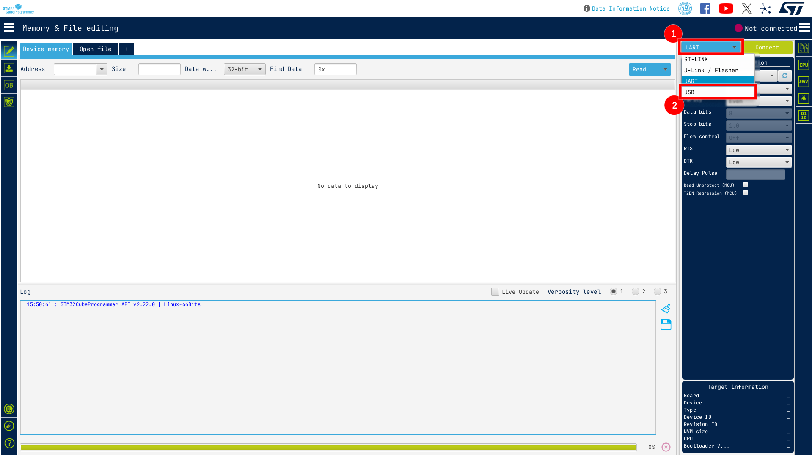
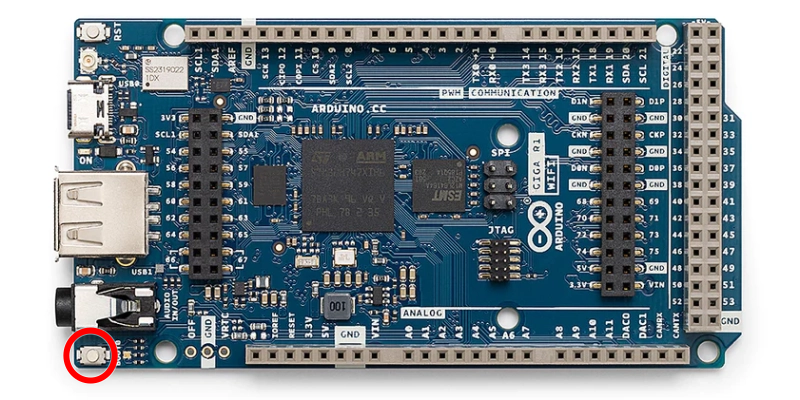
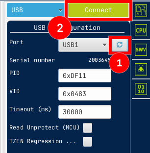
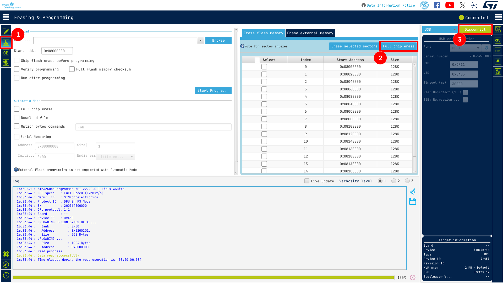

```{=typst}
#set page(
  header: align(right)[
    Version 0.1.0
  ],
  numbering: "1",
)
```

```{=typst}
#pagebreak()
```

# Background

This document outlines the procedure to recover a bricked Arduino Giga R1 board.

::: {.callout-important}
This guide does **NOT** return the Arduino Giga to its factory state *(ie the ability to flash via USB with the Arduino IDE)*. However it can be applicable as a first step to a factory restore to Arduino defaults.
:::

After having does a few tests with code generated by STM32CubeMX, I once found one of my Arduinos in a seemingly dead state, no signs of life other than the power LED and a daunting error when trying to flash: `Error: Failed to initialize DAP`. After many hours of trying things, I finally managed to figure out how to recover the mcu when it has been flashed with firmware that rendered it lifeless.

::: {.callout-note}
Once the board is recovered, **CHECK** your RCC configuration in STM32CubeMX, it is likely a power configuration issue where RCC tries to power from an external SMPS when it should be set to LDO_INTERNAL
:::

# Recovery
## Prerequisites
In order to recover the board, you will need the following:

- STM32CubeProgrammer
- A USB-C cable

## Process

{width=90%}

Open up STM32CubeProgrammer and set the connection mode to USB

{width=80%}

Then while holding down the `BOOT` button on the Arduino Giga, plug it in. Keep holding the button down for about 5 seconds then release.

{width=40%}

Then (1) click the refresh button in STM32CubeProgrammer, you should see a USB device appear, if it doesnt, unplug your board and try the previous step again.

Once the device is recognized, (2) click on connect to establish a connection to the board.

{width=90%}

You can now proceed to a chip erase:
1. Open the "Erasing and Programming" window
2. Click the "Full chip erase" button, acknowledge any warnings etc
3. Once the chip erase is complete, click disconnect

**Congrats**, you have successfully unbricked your board, you should now be able to connect to it via JLink. Now good luck finding the config fluke that bricked it.
